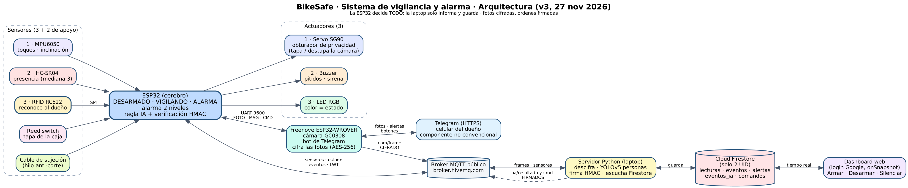
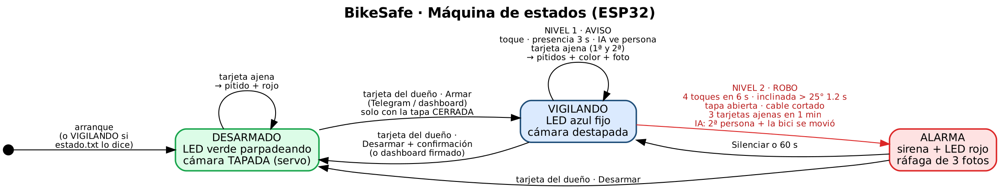
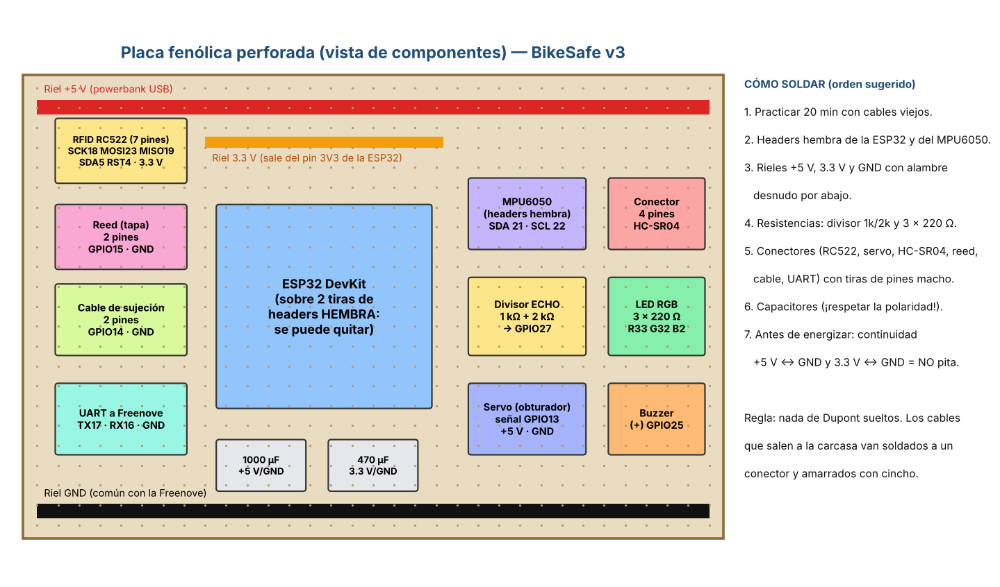
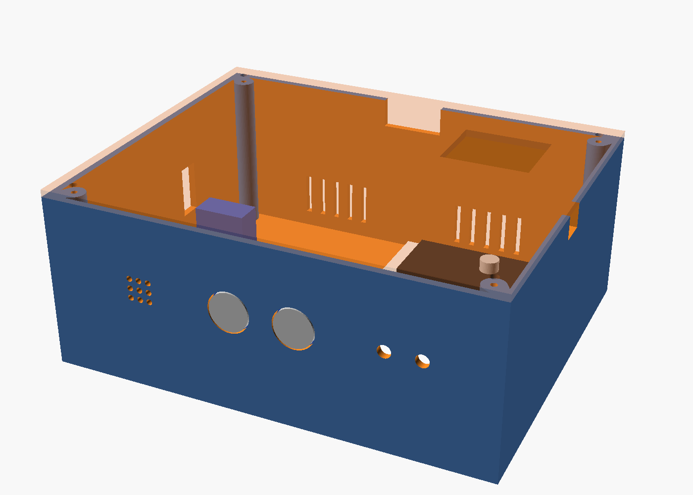
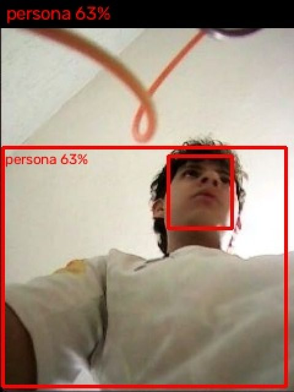
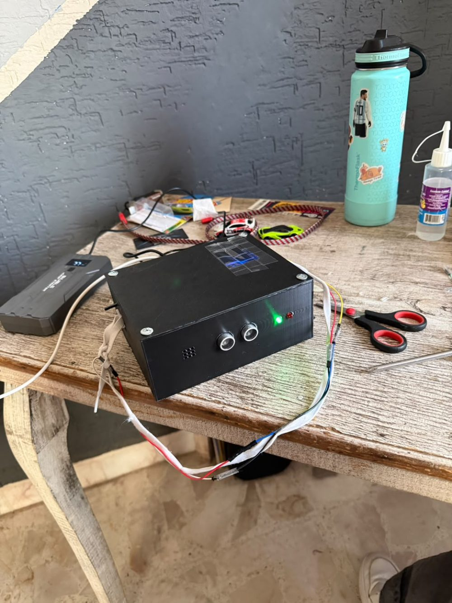
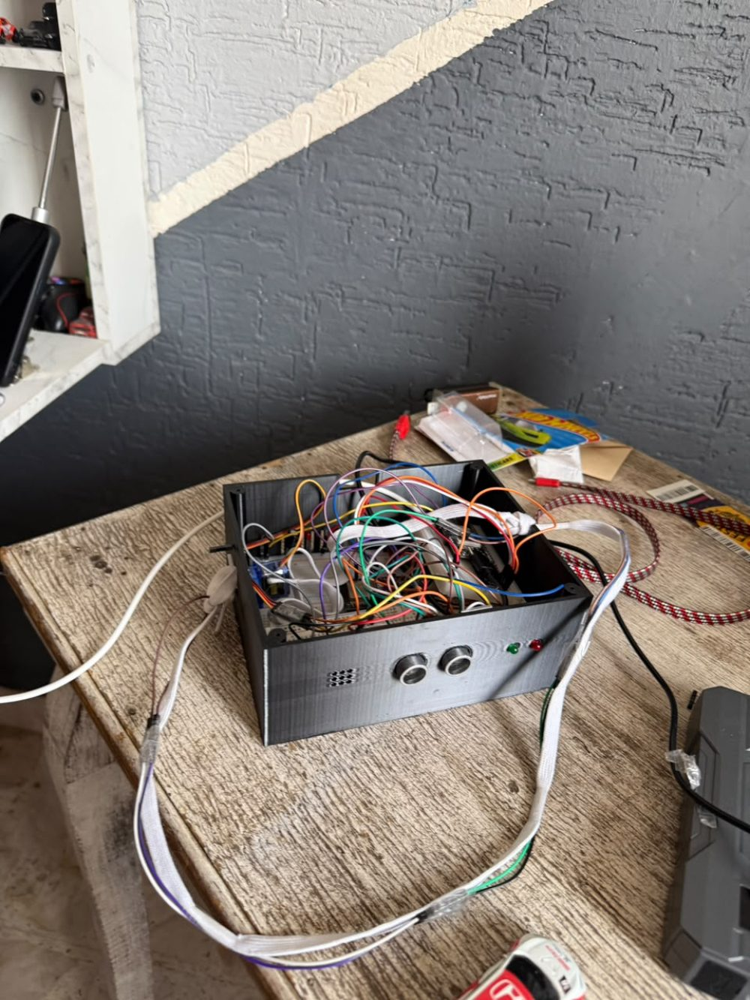
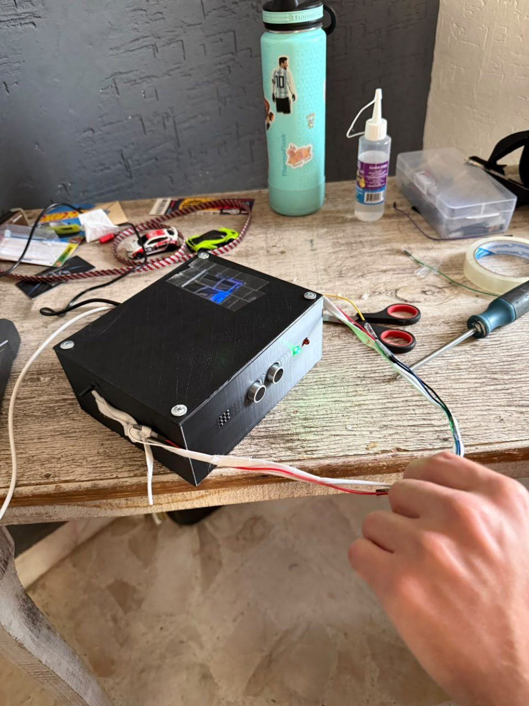
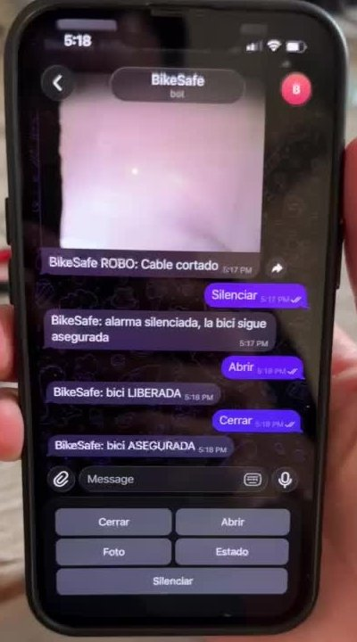

# BikeSafe — Sistema de vigilancia y alarma para bicicletas


> **Semestre:** ago-dic-2026
> **Materia:** Sistemas Programables — ISC TecNM León
> **Equipo:** 13 · Horario 10
> **Integrantes:**

| Nombre | Matrícula | Rol | GitHub |
|--------|-----------|-----|--------|
| Oscar Sandoval Cabrera | 23240457 | 🔧 Firmware ESP32 · 🧠 Servidor Python/IA · ☁️ Firebase/Interfaz | [@Sand027](https://github.com/Sand027) |
| Diego Josué Talamantes Santiago | 23240355 | 🔩 Hardware/Carcasa/Soldadura · 📝 Documentación | [@josuegoku2203-creator](https://github.com/josuegoku2203-creator) |

> 📋 **Revisiones de la maestra:** cada observación y lo que se cambió está en [docs/REVISION.md](docs/REVISION.md).

---

## 📌 Descripción General

**BikeSafe es un sistema de vigilancia y alarma** que se sujeta al cuadro de la bicicleta. **No es un candado:** no traba la bici. Lo que hace es vigilarla, distinguir un roce de un intento de robo, tomar fotos del sospechoso y avisarle al dueño al celular en segundos.

- **¿A quién ayuda?** A estudiantes y trabajadores que dejan su bici en bici-estacionamientos públicos (escuela, trabajo, centro), donde los robos son frecuentes.
- **¿Qué problema resuelve?** Con un candado común, el dueño se entera del robo cuando regresa. BikeSafe avisa **mientras** pasa, con sirena, luz, fotos y mensaje de Telegram.
- **¿Qué lo hace diferente?**
  - **Reconoce al dueño con su tarjeta RFID:** la pasa frente a la caja para armar o desarmar. Si alguien pasa una tarjeta que no es la suya, **pita, toma foto y avisa**.
  - **Bot de Telegram** (componente no convencional): controla todo desde el celular, sin instalar ninguna app.
  - **Alarma de dos niveles**, para no sonar con cada roce.
  - **IA (YOLOv5)** que confirma si hay una persona en la foto.
  - **Privacidad:** cuando está desarmado, un **obturador movido por el servo tapa la cámara**, y las fotos viajan **cifradas** por internet.
  - **Todas las decisiones se toman en la ESP32**: funciona aunque la laptop esté apagada.

### Cómo se usa

1. El dueño **sujeta la caja al cuadro** con la abrazadera y pasa el cable de sujeción alrededor del tubo.
2. **Pasa su tarjeta RFID** (o toca **Armar** en Telegram). El servo **destapa la cámara**, el LED se pone azul y empieza a **VIGILAR**.
3. Si alguien mueve la bici, se acerca mucho, abre la caja, corta el cable o pasa tarjetas ajenas, BikeSafe **pita, prende luz, toma fotos y le manda todo al dueño**.
4. Al regresar, **pasa su tarjeta** (o toca **Desarmar**). El servo **vuelve a tapar la cámara** y el LED regresa a verde.

### Alcance y límites (honestos)

| Sí hace | No pretende |
|---|---|
| Detectar el intento de robo en segundos y avisar con sirena, luz, fotos y Telegram | Impedir físicamente el robo. **No es un candado**: recomendamos usarlo junto con uno |
| Reconocer al dueño por su tarjeta RFID y reaccionar ante tarjetas desconocidas | Resistir que alguien rompa la caja a golpes: si lo hacen, ya sonó la alarma y llegaron las fotos |
| Disuadir: sirena de 60 s, luz roja y evidencia fotográfica | Funcionar sin energía. Con una powerbank de 10 000 mAh dura ~10–12 h vigilando |

La caja se sujeta al cuadro con una **abrazadera sin fin (tipo gusano) de acero inoxidable** con almohadilla de hule. El **sensor magnético (reed switch)** detecta si alguien **abre la caja**, y el **cable de sujeción** lleva un hilo por dentro: si lo cortan, el circuito se abre y suena la alarma.

---

## 🏗️ Arquitectura del Sistema



- **ESP32 normal (el cerebro):** lee los 3 sensores (acelerómetro, ultrasónico y RFID) y los 2 de apoyo (tapa y cable), ejecuta la máquina de estados y la **alarma de 2 niveles**, mueve los 3 actuadores y **decide qué hacer con lo que reporta la IA**. Rechaza cualquier mensaje MQTT que no venga firmado (HMAC-SHA256).
- **Freenove ESP32-WROVER (el fotógrafo):** toma las fotos que le pide la ESP32 por UART, las manda a Telegram por HTTPS y al servidor **cifradas** por MQTT. También atiende el **bot de Telegram** y le pasa los botones a la ESP32 como `CMD|armar`.
- **Servidor Python (laptop):** descifra cada foto, la pasa por **YOLOv5** (detección de personas) y **solo informa** el resultado firmado a la ESP32. Guarda todo en Firestore y **escucha en tiempo real** los comandos del dashboard.
- **Dashboard web:** inicia sesión con Google, muestra todo en vivo (`onSnapshot`) y tiene botones de control que se escriben en Firestore.

### Máquina de estados



| Estado | LED | Cámara | Qué pasa |
|---|---|---|---|
| **DESARMADO** | Verde parpadeando | **Tapada** por el obturador | El dueño está con su bici. Una tarjeta ajena solo pita |
| **VIGILANDO** | Azul fijo | Destapada | Revisa los sensores. Un toque = **aviso** (amarillo + foto); varios toques, inclinación, caja abierta, cable cortado o 3 tarjetas ajenas = **ALARMA** |
| **ALARMA** | Rojo parpadeando | Destapada | Sirena 60 s y ráfaga de 3 fotos. Se calla con **Silenciar** o sola al minuto, y regresa a VIGILANDO |

### ¿Qué pasa si se apaga la laptop?

Nada grave. La alarma, la sirena, el RFID, las fotos y el bot de Telegram viven en las **dos placas**. Sin laptop solo se pierde la confirmación de la IA y el historial en Firebase. Si se cae el internet, BikeSafe sigue vigilando y sonando, y las alertas se guardan y se mandan cuando vuelve la conexión.

### Tópicos MQTT

| Tópico | Dirección | Descripción |
|--------|-----------|-------------|
| `bikesafe/sensor/distancia` | ESP32 → Broker | Distancia del HC-SR04 (cm, mediana de 3) |
| `bikesafe/sensor/movimiento` | ESP32 → Broker | Cambio de aceleración del MPU6050 (g) |
| `bikesafe/sensor/inclinacion` | ESP32 → Broker | Inclinación de la bici (°) |
| `bikesafe/sensor/tapa` | ESP32 → Broker | Reed switch de la tapa: `CERRADA` / `ABIERTA` |
| `bikesafe/sensor/lazo` | ESP32 → Broker | Cable de sujeción: `ENTERO` / `CORTADO` |
| `bikesafe/sensores` | ESP32 → Broker | Todas las lecturas en JSON (cada 2 s), con el color del LED y el obturador |
| `bikesafe/estado` | ESP32 → Broker | `DESARMADO` / `VIGILANDO` / `ALARMA` (retenido) |
| `bikesafe/conexion` | ESP32 → Broker | `online`; `offline` lo publica el broker si la ESP32 se cae (*last will*) |
| `bikesafe/alerta` | ESP32 → Broker | Texto de cada aviso o robo |
| `bikesafe/evento` | ESP32 → Broker | JSON de cada cambio de estado, comando, tarjeta y origen (historial) |
| `bikesafe/cam/info` · `bikesafe/cam/frame` | Freenove → Broker | **Cifrados** (AES-256 + HMAC): nivel/motivo y foto JPEG 320×240 |
| `bikesafe/ia/resultado` | Servidor → ESP32 | **Firmado.** `{"clase", "conf", "personas"}`: la ESP32 decide |
| `bikesafe/cmd` | Servidor → ESP32 | **Firmado.** `armar` · `desarmar` · `silenciar` · `foto` · `buscar` |
| `bikesafe/servo/cmd` | Broker → ESP32 | Actuador 1 (firmado): `tapar` / `destapar` |
| `bikesafe/buzzer/cmd` | Broker → ESP32 | Actuador 2 (firmado): `pitido` / `sirena_off` |
| `bikesafe/led/cmd` | Broker → ESP32 | Actuador 3 (firmado): `alerta` / `normal` / `<color>` |

**¿Por qué firmar?** `broker.hivemq.com` es público, así que cualquiera que adivine el tópico podría publicar `desarmar`. Por eso cada mensaje hacia la ESP32 va como `orden|contador|firma`, donde la firma es HMAC-SHA256 con una clave que **nunca viaja por la red** ([firma.py](firmware/esp32/firma.py)). Sin la clave, la firma no sirve. Y como el contador siempre crece y se guarda en la flash, un mensaje grabado y repetido también se rechaza.

---

## 🔒 Seguridad y privacidad de las fotos

**Pregunta de la revisión:** *¿las fotos viajan por un broker público? ¿cómo se protege la privacidad?*

**Antes sí viajaban abiertas** por `broker.hivemq.com`: cualquiera suscrito a `bikesafe/cam/frame` podía verlas. Ahora:

| Medida | Qué protege | Dónde |
|---|---|---|
| **Fotos cifradas** antes de salir de la Freenove: AES-256-CBC con IV aleatorio + HMAC-SHA256 (*encrypt-then-MAC*). Formato `BS1 + IV + datos + firma` | Alguien suscrito al broker solo ve bytes al azar. Si alguien modifica la foto, el servidor la descarta | [firmware/camara/cifrado.py](firmware/camara/cifrado.py) · `servidor/mqtt_bridge.py` |
| **La clave nunca viaja:** de `MQTT_CLAVE` se derivan dos claves distintas (una para cifrar y otra para firmar) | Sin la clave no se puede ni ver ni falsificar | `config.py` de cada placa (no se suben) |
| **Si no hay clave, no publica** | Un error de configuración no deja fotos abiertas | `publicar_frame()` en la Freenove |
| **Obturador:** desarmado, el servo **tapa la lente** con una pestaña | La cámara no graba al dueño ni a la gente que pasa cuando no hace falta | `Obturador` en [hal/actuadores.py](firmware/esp32/hal/actuadores.py) |
| **Telegram por HTTPS** y solo al `TELEGRAM_CHAT_ID` del dueño | Nadie más recibe las fotos | [firmware/camara/telegram.py](firmware/camara/telegram.py) |
| **Servidor web de la cámara apagado** (`USAR_WEB = False`) | Nadie de la misma red WiFi puede ver la cámara en vivo | `config.example.py` de la Freenove |
| **Firestore cerrado:** solo Oscar y Diego leen, con sesión de Google | Las miniaturas de la IA no son públicas | [interfaz/firestore.rules](interfaz/firestore.rules) |
| **Fotos solo cuando hay un evento** (aviso, robo o foto pedida), no video continuo | Se guarda lo mínimo necesario | `main.py` de la ESP32 |

Esto se comprueba en la prueba de punta a punta: el frame que pasa por el broker empieza con `BS1` (no con `FF D8` de un JPEG), con otra clave no se puede descifrar y el servidor sí lo descifra y lo analiza.

---

## 🛠️ Hardware

### Sensores y actuadores (3 + 3)

| # | Componente | Tipo | Función en BikeSafe |
|---|-----------|------|------|
| 1 | Acelerómetro MPU6050 | **Sensor 1** | Detecta toques, forcejeo e inclinación de la bici |
| 2 | Ultrasónico HC-SR04 | **Sensor 2** | Detecta a alguien parado junto a la bici (< 50 cm por 3 s) |
| 3 | Lector RFID RC522 (prestado por la maestra) + tarjeta y llavero | **Sensor 3** | Reconoce al dueño para armar y desarmar; cuenta tarjetas ajenas |
| 4 | Servo SG90 | **Actuador 1** | **Obturador de privacidad:** tapa la cámara desarmado y la destapa al vigilar |
| 5 | Buzzer | **Actuador 2** | Pitidos de confirmación y sirena de alarma |
| 6 | LED RGB + 3 resistencias 220 Ω | **Actuador 3** | Muestra el estado con colores |
| — | Reed switch + imán | Apoyo | Detecta si abren la tapa de la caja |
| — | Hilo dentro del cable de sujeción | Apoyo | Detecta si cortan el cable |
| — | Freenove ESP32-WROVER (cámara GC0308) | Cámara | Toma las fotos y atiende el bot |

### Costos

| # | Componente | Cant. | Costo MXN | Origen |
|---|-----------|------|-----------|--------|
| 1 | ESP32 DevKit (WROOM-32) | 1 | $120 | Kit ESP32 propio |
| 2 | Freenove ESP32-WROVER con cámara GC0308 | 1 | $420 | Compra |
| 3 | MPU6050, HC-SR04, servo SG90, buzzer, LED RGB | 1 c/u | $170* | Préstamo de la maestra |
| 4 | RFID RC522 + tarjeta y llavero | 1 | $80* | Préstamo de la maestra |
| 5 | Reed switch + imán | 1 | $25 | Compra |
| 6 | Cable de sujeción con hilo sensor | 1 | $15 | Compra |
| 7 | Divisor 1 kΩ/2 kΩ, capacitores 1000 µF, 470 µF y 2 × 104 | — | $31 | Compra |
| 8 | Placa fenólica perforada, estaño y headers | 1 | $25 | Placa regalada por la maestra + headers |
| 9 | Carcasa impresa en 3D (PETG) | 1 | $150 | Impresión con Gael |
| 10 | Abrazadera sin fin inoxidable + almohadilla de hule | 1 | $40 | Compra |
| 11 | Powerbank USB + cable "Y" | 1 | $0 | Propia |
| | **Gastado por el equipo** (2, 5, 6, 7, 8, 9, 10) | | **$706** | |
| | **Costo total del prototipo** (con kit y préstamos) | | **$1,076** | |

\* Precio de referencia en tiendas en línea de México. No lo pagamos: es préstamo.

> **Sobre el límite de $800:** lo que el equipo gastó ($706) entra en el presupuesto. El costo total lo rebasa por la Freenove ($420). La elegimos porque se programa directo por USB-C y trae PSRAM para las fotos; la ESP32-CAM común es más barata, pero necesita una base programadora aparte.

### Diagrama de conexiones y placa soldada



Lista completa de conexiones y procedimiento de soldadura: **[docs/SOLDADURA.md](docs/SOLDADURA.md)**.

| Más diagramas | |
|---|---|
| [Protoboard (versión anterior, sin RFID)](hardware/protoboard-sin-rfid.png) | [Alimentación y rieles](hardware/energia.png) |
| [Diagrama de bloques](hardware/bloques.png) | [Diagrama de conexiones anterior](hardware/diagrama-sin-rfid.png) |

### Carcasa impresa en 3D



Caja de PETG (181 × 146 × 75 mm armada) diseñada en OpenSCAD y paramétrica. Tiene orificios para el HC-SR04, el LED y el buzzer en la pared frontal, una ventana para la cámara en la tapa (con el obturador del servo por dentro), ranuras para el USB y el cable de sujeción, y la tapa va con 4 tornillos. Archivos en [`hardware/carcasa-3d/`](hardware/carcasa-3d/).

---

## 💻 Software y Firmware

```
equipo-13-bikesafe/
├── firmware/
│   ├── esp32/        ← ESP32 cerebro: main.py, red.py, firma.py, config.example.py, hal/, lib/mfrc522.py
│   ├── camara/       ← Freenove: main.py, telegram.py (bot), cifrado.py, config.example.py
│   └── pruebas/      ← una prueba por pieza (e02_servo.py … e14_tapa_reed.py, diag_rfid.py)
├── servidor/         ← mqtt_bridge.py, ia/detector.py (YOLOv5), nube.py, simular_placas.py
├── interfaz/         ← dashboard (index.html), reglas de Firestore y de Realtime DB, bot-telegram.md
├── hardware/         ← arquitectura, estados, placa perforada y carcasa-3d/
├── media/            ← fotos del prototipo y evidencias
├── pruebas_pc/       ← simulación de las placas y prueba de punta a punta (ver LEEME.md)
└── docs/             ← REVISION.md, SOLDADURA.md, DEMO.md, infografía y reporte
```

### Cómo ejecutar el sistema completo

**1. Firmware (Thonny).** Cada placa tiene un `config.example.py`: cópienlo como `config.py` y llénenlo. Los `config.py` reales **no se suben** (están en `.gitignore`).
- **ESP32 normal (COM8):** subir `main.py`, `red.py`, `firma.py`, `config.py` y las carpetas `hal/` y `lib/`. En `TARJETAS_DUENO` va el UID de la tarjeta del dueño (lo imprime `pruebas/e10_rfid.py`). Si sale `MQTT: este firmware no trae umqtt`: `import mip; mip.install("umqtt.simple")`.
- **Freenove (COM7, "SPIRAM"):** MicroPython **con cámara** (`mpy_cam-…-ESP32_GENERIC-SPIRAM`). Subir `main.py`, `telegram.py`, `cifrado.py` y `config.py` (WiFi, token y chat_id del bot).
- **Clave MQTT:** el mismo texto en `MQTT_CLAVE` del `config.py` de **las dos placas** y en `servidor/clave_mqtt.txt`.

**2. Servidor + dashboard** (doble clic en `INICIAR_DEMO.bat`, o a mano):
```bash
pip install -r servidor/requirements.txt
cd servidor && python mqtt_bridge.py          # IA + Firebase + escucha de comandos
cd interfaz && python -m http.server 8000     # dashboard en http://localhost:8000
```
Sin placas: `python simular_placas.py ../media/ia-deteccion-persona.jpg`. Con `?demo=1`, el dashboard muestra datos de ejemplo.

### Librerías ESP32 (MicroPython — corren en la placa)

| Librería | Uso |
|---------|-----|
| `umqtt.simple` | MQTT con *last will* (`offline`) y ping cada 15 s |
| `machine` | GPIO, PWM (servo, buzzer), I2C (MPU6050), SPI (RC522), UART (enlace entre placas), WDT |
| `mfrc522` (en `lib/`) | Lector RFID RC522 por SPI |
| `network` | WiFi con reintentos y escaneo de redes |
| `hashlib` + `binascii` | HMAC-SHA256 escrito a mano en `firma.py` (MicroPython no trae `hmac`) |
| `cryptolib` + `os.urandom` | AES-256-CBC para cifrar las fotos (Freenove) |
| `camera` + `jpeg` | Cámara GC0308 y conversión a JPEG (firmware `micropython-camera-API`) |
| `ssl` + `socket` | Bot de Telegram por HTTPS (`sendMessage`, `sendPhoto`, `getUpdates`) |

### Librerías servidor Python (corren en la PC)

| Librería | Versión | Uso |
|---------|---------|-----|
| paho-mqtt | ≥ 2.0 | Cliente MQTT del servidor |
| opencv-python | ≥ 4.8 (probado en 5.0) | `cv2.dnn` para correr YOLOv5 (ONNX) |
| numpy | ≥ 1.24 | Manejo de la imagen |
| cryptography | ≥ 41 | Descifrar las fotos (AES-256-CBC + HMAC) |
| firebase-admin | ≥ 6.0 | Escritura en Firestore y escucha `on_snapshot` |

---

## 🧠 Inteligencia Artificial

- **Modelo:** **YOLOv5s** entrenado en COCO (`servidor/ia/modelos/yolov5s.onnx`, 14 MB), corriendo con `cv2.dnn`, sin PyTorch.
- **Qué detecta:** **personas** (clase 0 de COCO), aunque solo se vea el cuerpo, un brazo o la cabeza de lado. Antes usábamos YuNet, que solo detectaba **caras**: alguien de espaldas o con gorra no salía. La cámara ve hacia arriba por la ventana de la tapa, así que la foto se prueba girada 0°/90°/180°/270° y se aplica **NMS** más un filtro de cajas contenidas, para no contar dos veces a la misma persona.
- **¿Por qué YOLO y no MobileNet-SSD?** OpenCV 5 (el que tenemos en la laptop) **ya no lee modelos Caffe** (`readNetFromCaffe` no existe). YOLOv5 en ONNX funciona igual en OpenCV 4.8 y 5.
- **Cómo toma decisiones:** el servidor **solo informa** `{"clase": "persona", "conf": 0.58, "personas": 1}` firmado. La **ESP32 decide** con su propia regla (`config.py`):

| Situación (VIGILANDO) | Decisión de la ESP32 |
|---|---|
| `conf` < 45 % | Se ignora |
| Persona ≥ 45 % | **Aviso:** 3 pitidos, LED morado y Telegram "🤖 la IA confirmó una persona (58 %)" |
| 2ª persona en 2 min **y** la bici se movió | **ROBO:** sirena, LED rojo y ráfaga de fotos |

- **Confianza mínima aceptada:** 45 % (`IA_CONFIANZA_MINIMA` en la ESP32 y `CONFIANZA_MINIMA` en el servidor).
- **Pruebas con 11 fotos reales de nuestra cámara:** 5 se detectaron como persona, entre 51 y 71 %. Una de ellas solo muestra una **mano**, que YuNet no habría detectado. Las 4 sin nadie dieron 0 %. En 2 fotos la cara apenas asoma en una orilla y quedaron debajo del umbral (39 % y 0 %): es la limitación de una cámara de 320×240 que ve hacia arriba. Tarda ~0.6 s por foto con los 4 giros.



---

## 🎥 Demostración

**Video demostrativo (YouTube):** _(se sube con la versión soldada)_ · Guion: [docs/DEMO.md](docs/DEMO.md)

| Prototipo (frente) | Interior antes de soldar | En operación | Telegram: alerta con foto |
|---|---|---|---|
|  |  |  |  |

> La foto del interior muestra el cableado **con Dupont**, que la maestra observó en la revisión. Se está pasando a placa perforada soldada ([docs/SOLDADURA.md](docs/SOLDADURA.md)).

---

## 📋 HAL — Hardware Abstraction Layer

| # | Componente | Pin ESP32 | Tópico MQTT | Unidad | Rango válido |
|---|-----------|-----------|-------------|--------|-------------|
| 1 | MPU6050 (movimiento) | I2C SDA GPIO21 · SCL GPIO22 | `bikesafe/sensor/movimiento` | g | 0 – 2 (toque > 0.18) |
| 1b | MPU6050 (inclinación) | I2C SDA GPIO21 · SCL GPIO22 | `bikesafe/sensor/inclinacion` | ° | 0 – 180 (robo > 25° por 1.2 s) |
| 2 | HC-SR04 (ultrasónico) | TRIG GPIO26 · ECHO GPIO27 (divisor 1 kΩ/2 kΩ) | `bikesafe/sensor/distancia` | cm | 2 – 400 (presencia < 50 por 3 s) |
| 3 | RFID RC522 | SPI (VSPI): SCK GPIO18 · MOSI GPIO23 · MISO GPIO19 · SDA GPIO5 · RST GPIO4 · **3.3 V** | `bikesafe/evento` (tipo `rfid`) | UID | 4 bytes en hex (`TARJETAS_DUENO`) |
| 3b | Reed switch (tapa) | GPIO15 (pull-up interno) | `bikesafe/sensor/tapa` | — | `CERRADA` / `ABIERTA` (robo si abre > 0.5 s vigilando) |
| 3c | Cable de sujeción | GPIO14 (pull-up interno) | `bikesafe/sensor/lazo` | — | `ENTERO` / `CORTADO` |
| 4 | Servo SG90 (obturador) | GPIO13 (PWM 50 Hz) | `bikesafe/servo/cmd` | ° | 0 (tapado) – 90 (destapado) |
| 5 | Buzzer | GPIO25 | `bikesafe/buzzer/cmd` | — | `pitido` / `sirena_off` |
| 6 | LED RGB | R GPIO33 · G GPIO32 · B GPIO2 (220 Ω c/u) | `bikesafe/led/cmd` | color | verde desarmado · azul vigilando · rojo alarma · amarillo aviso · morado IA · cian presencia · blanco buscar |
| 7 | Freenove ESP32-WROVER | UART: TX2 GPIO17 → GPIO33 · RX2 GPIO16 ← GPIO32 | `bikesafe/cam/frame` | JPEG cifrado | 320 × 240 |

> **Cambio de pines por el RFID:** el RC522 usa el bus SPI por hardware (VSPI: 18, 19, 23), donde antes estaban el reed (18) y el azul del LED (19). El reed se movió a **GPIO15** y el azul a **GPIO2**. Los dos son *strapping pins*, pero no estorban: el reed lleva pull-up y el LED solo enciende cuando el programa ya arrancó.

### Pines de la Freenove (placa de la cámara)

| Grupo | Pines de la Freenove | Va a | Notas |
|------|----------------------|------|-------|
| **Enlace con la ESP32** (UART 9600) | **GPIO33** = RX · **GPIO32** = TX | TX2 (17) · RX2 (16) de la ESP32 | Cruzados |
| | **GND** | Riel GND | **Obligatorio:** sin GND común no se entienden |
| **Alimentación** | **USB-C** (5 V) | Powerbank (cable "Y") | Tomar 5 V del riel de la ESP32 no alcanza |
| **Cámara** (fijos) | D0–D7: 4, 5, 18, 19, 36, 39, 34, 35 · VSYNC 25 · HREF 23 · PCLK 22 · XCLK 21 · SDA 26 · SCL 27 | Cable plano | No conectar nada más aquí |

---

## 📱 Bot de Telegram (componente no convencional)

El **bot de Telegram** es el componente no convencional del proyecto: convierte el celular del dueño en el control y la pantalla de BikeSafe sin programar ninguna app.

| Botón | Qué hace |
|---|---|
| **Armar** | Empieza a vigilar, solo si la tapa de la caja está cerrada |
| **Desarmar** | Pregunta **"¿Seguro?"** (Sí, desarmar / No, válido 30 s) y deja de vigilar |
| **Foto** | Foto en ese momento (si está desarmado, destapa la cámara 6 s) |
| **Estado** | Estado, cámara, tapa, cable, distancia, inclinación, última IA, RFID, conexión, avisos y robos |
| **Buscar** | Suena 5 s con el LED blanco para encontrar la bici |
| **Silenciar** | Calla la sirena; sigue vigilando |

Solo obedece al `TELEGRAM_CHAT_ID` del dueño, y si un extraño le escribe, **le avisa al dueño**. Si alguien desarma desde el dashboard, el dueño recibe "👋 DESARMADO (desde dashboard)". Más detalle en [interfaz/bot-telegram.md](interfaz/bot-telegram.md).

---

## 🔥 Esquema Firebase

Cloud Firestore en **las dos direcciones**:
- **Guarda:** el servidor escribe lecturas, alertas, eventos, decisiones de la IA y el estado actual.
- **Escucha en tiempo real:** el dashboard usa `onSnapshot` en 6 consultas y se actualiza solo. El servidor usa `on_snapshot` sobre `comandos`: cuando alguien pica un botón del dashboard, en menos de 1 s lo firma y se lo manda a la ESP32. Además marca el comando como `enviado`, `caducado` (> 60 s) o `rechazado`, y el dashboard ve ese cambio en vivo.

```
proyectos/bikesafe/
  lecturas/{id}     distancia, movimiento, inclinacion, tapa, obturador, lazo, luz, estado, ts
  alertas/{id}      texto, estado, ts
  eventos/{id}      tipo (estado|comando|conexion|tapa|rfid), detalle, origen, estado, ts
  eventos_ia/{id}   deteccion, confianza, personas, modelo, giro, nivel, motivo, imagen (JPEG base64), ts
  comandos/{id}     cmd (armar|desarmar|silenciar|foto|buscar|pitido|led_prueba), uid, nombre, creado
                    estado: pendiente → enviado / caducado / rechazado, nota, procesado  ← lo marca el servidor
  estado/actual     estado, conexion (LWT), servidor, tapa, obturador, lazo, luz, distancia, ultima_ia, ultima_alerta, actualizado
```

**Reglas (nada público)** — [`interfaz/firestore.rules`](interfaz/firestore.rules):
- **Leer:** solo los UID de Oscar y Diego, con sesión de Google.
- **Escribir desde el navegador:** solo **crear** un comando de la lista permitida, con su propio `uid`, estado `pendiente`, hora del servidor y sin campos extra. No se puede editar ni borrar nada.
- **Todo lo demás lo escribe solo el servidor** (llave de servicio). Cualquier otra ruta está cerrada.
- **Realtime Database:** el proyecto **no la usa ni la tiene creada** (no existe ningún `".read": true`). Si algún día se crea, [`interfaz/database.rules.json`](interfaz/database.rules.json) la deja cerrada.


---

## 💳 RFID: qué falló la primera vez y cómo se resolvió

**Pregunta de la revisión:** *explicar con evidencia qué falló del RFID.*

En la primera versión el equipo compró un **RC522** para armar y desarmar con llavero. **Nunca respondió.** Esto fue lo que medimos (11 al 19 de noviembre):

| Prueba | Resultado | Qué significa |
|---|---|---|
| Al conectarlo | El LED rojo del módulo prendía | Le llegaba corriente |
| Primera soldadura de los headers | Un **puente de estaño** hacía corto entre 3.3 V y GND | Se calentó el módulo; se quitó el puente |
| `pruebas/e10_rfid.py` (leer la versión del chip, registro `0x37`) | `0x00` / `0xFF` siempre | Nadie contestaba en el bus SPI |
| `pruebas/diag_rfid.py`, parte 1 (MISO con pull-up y pull-down) | MISO **"al aire"**: seguía al pull-up y al pull-down | El chip nunca maneja la línea de datos de regreso |
| `diag_rfid.py`, parte 2: **8 combinaciones** (SPI por hardware y por software, 3 velocidades, MOSI/MISO invertidos) | Ninguna funcionó: `0x00`, `0xFF` o `0xEE` | No era un problema de configuración del código |
| Multímetro en MOSI con la ESP32 mandando 3.3 V | Solo **0.48 V** en la patita del RC522 | Unión floja del jumper hembra-macho en la protoboard |
| Cambio de jumpers y de pines (MOSI → D15, SDA → D2) | Seguía en `0x00` / `0xFF` | Lo más probable: el chip quedó dañado por el corto |

**Decisión de entonces:** por tiempo, el control se pasó al **bot de Telegram** y el RFID se quitó del código (`USAR_RFID = False`).

**Ahora:** la maestra nos prestó un **RC522 que sí funciona**, y el RFID volvió como **sensor 3**: reconoce al dueño. Va **soldado** a la placa perforada (sin protoboard ni jumpers unidos) y usa el **SPI por hardware** (VSPI). Por eso el reed y el azul del LED cambiaron de pin. El firmware revisa la versión del chip al arrancar: si contesta `0x00`/`0xFF`, avisa por Telegram y BikeSafe sigue funcionando con el bot y el dashboard.

> 📷 Las fotos del primer RC522 conectado en la protoboard están en [`media/rfid-primer-intento-*.jpg`](media/) y la captura de `diag_rfid.py` en [`media/rfid-diagnostico.jpg`](media/).

---

## ⚠️ Retos técnicos encontrados

1. **La cámara GC0308 no genera JPEG por hardware** (`ESP_ERR_NOT_SUPPORTED`). Se captura en RGB565 y se convierte con el módulo `jpeg` (`RGB565_BE`, reloj de 10 MHz).
2. **El servo no se movía:** un **jumper roto por dentro** (0.1–0.5 V en vez de 5 V). Por eso, y por la vibración de la bici, el circuito final va **soldado**.
3. **El buzzer no sonaba con el 2N2222:** se conectó directo a D25.
4. **Las pruebas corrían en la placa equivocada:** Thonny estaba en la Freenove (`SPIRAM`) y no en la ESP32 (COM8).
5. **El primer lector RFID nunca respondió** (ver la sección anterior). Se resolvió con un módulo nuevo, soldado y en el bus SPI por hardware.
6. **Conflicto de pines:** el RFID necesita 18, 19 y 23 (SPI). El reed pasó a GPIO15 y el azul del LED a GPIO2.
7. **El concepto de "candado" no se cumplía:** un servo SG90 no traba una bici. Se cambió el enfoque a **vigilancia y alarma**, y el servo pasó a ser el **obturador de privacidad** de la cámara.
8. **`Wifi Internal State Error`:** se arregló con `disconnect()` y apagar/prender el WiFi antes de conectar, más 3 reintentos.
9. **Broker público = cualquiera puede publicar y ver.** Solución: órdenes firmadas con HMAC-SHA256 y contador anti-repetición, y **fotos cifradas** con AES-256.
10. **OpenCV 5 ya no lee Caffe:** por eso MobileNet-SSD no corría y elegimos YOLOv5 en ONNX.
11. **YuNet solo veía caras:** se cambió a detección de **personas** (YOLOv5, COCO), que también detecta cuerpos y manos.
12. **El broker cortaba a la cámara por inactividad** y se perdía la siguiente foto. Solución: ping cada 30 s y reintento con reconexión.
13. **La powerbank tiene una sola salida:** cable USB "Y" para alimentar las dos placas.

### Cómo lo probamos

Antes de cargarlo a las placas, el firmware se probó en una **simulación** con módulos `machine`, `network`, `umqtt`, `mfrc522` y `cryptolib` de mentira y un reloj virtual: **65 pruebas** de la ESP32 (RFID del dueño y ajenas, tapa, obturador, firma, alarma de 2 niveles) y **20** de la Freenove (bot, cifrado de fotos). Después hubo una prueba **de punta a punta** con un broker MQTT real: ESP32 simulada ↔ UART ↔ Freenove simulada → broker (foto cifrada) → servidor que la descifra y la pasa por YOLO → resultado firmado → la ESP32 decide → Telegram. Fueron **19 pruebas**, incluidos los comandos del dashboard, la firma, la repetición y la caducidad. Detalle en [pruebas_pc/LEEME.md](pruebas_pc/LEEME.md).

---

## 🗓️ Avance por sprint

| Sprint | Entregable | Estado |
|--------|-----------|--------|
| 1 · HAL + MQTT | 3 sensores (MPU6050, HC-SR04, RFID) y 3 actuadores (servo, buzzer, LED RGB), tópicos, Tabla HAL | ✅ Código y pruebas · 🟡 montar RFID, reed y LED RGB en la placa soldada |
| 2 · CAM + IA | Cámara publica frames cifrados, IA de personas, la ESP32 decide | ✅ YOLOv5 probado con fotos reales |
| 3 · Firebase + carcasa | Firestore en las 2 direcciones, dashboard con control, carcasa | ✅ Firebase y dashboard · ✅ carcasa impresa · 🟡 soldadura y obturador |
| 4 · Final | Video, reporte PDF, fotos con la versión soldada | 🟡 En proceso (cierre: lunes 30 de noviembre, 11:59) |

---

*Sistemas Programables · ISC TecNM León · ago-dic-2026*
